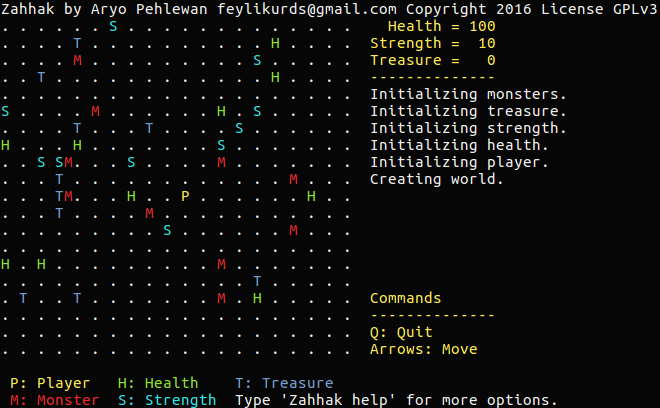

# Zahhak, a C# 6.0 coding sample in form of a console game.

## Download
[Click here to download the game.](downloads/Zahhak.exe?raw=true)

It runs in Windows, OS X, and Linux

OBS! One must have the .NET Framework or Mono installed.

## Purpose
To create a simple game for beginners to learn the C# programming language. I do hope that teachers use the code as a learning exercise for students.

## Development
This was written in C# 6.0 with Visual Studio 2015.

## Documentation
I will add a better explaination later.

## Miscellaneous
Check out my programming blog! http://ar.hn/blog

## License
Copyright (c) 2016 Aryo Pehlewan feylikurds@gmail.com 
Licensed under the GPL license.
